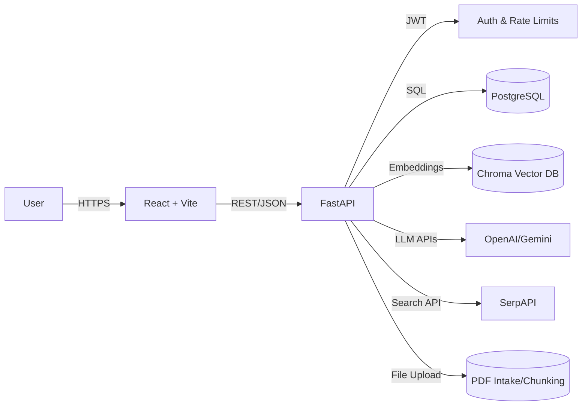

# Assignment Deliverables

This document distills what to ship for the assignment and how the repo artifacts map to the evaluation criteria.

## Deliverables Checklist
- Full source: backend and frontend live in this repo (see README.md for setup). Docker, Compose, k8s, and Helm assets are included for deployment.
- README: primary instructions in README.md; keep run commands and env vars in sync with code.
- Component structure: React builder panels in frontend/src/components (canvas, config, chat, auth, logs, manager) and FastAPI routes/services in backend/app.
- Demo video: 4–5 minute screen recording linked in this file once ready.
- Architecture diagram: maintained below; update if services change.

## Architecture Diagram

## Demo Recording Script (4–5 minutes)
- Launch: show backend /docs running and frontend home; mention env keys loaded.
- Auth: register/login or choose anonymous mode; show token presence in calls.
- Build: add user query, knowledge base, LLM engine, and output nodes; connect edges; configure provider/model/top-k.
- Validate: run Build/Validate and surface success state.
- Upload: configure knowledge node, upload a PDF, confirm collection appears.
- Run: open chat panel, ask a grounded question, show response with context; toggle web search if used.
- Persist: save workflow, load it back from manager, delete one to show CRUD.
- Logs: open execution logs, filter by status, highlight timing/provider/context columns.
- Close: recap stack (FastAPI + Postgres + Chroma + OpenAI/Gemini + SerpAPI) and point to README.md for setup.

## Evaluation Criteria Mapping
- Functional correctness: verify auth, workflow CRUD, validate, chat run, document upload, logs; include healthcheck.
- UI/UX: workflow builder clarity (drag/drop, empty states, toasts, loading); chat usability; logs readability.
- Backend and API: documented endpoints, validation, consistent errors, rate limiting, JWT, database schema in code.
- Code clarity and docs: organized modules, minimal comments where logic is dense, linted code, updated README.
- Tooling use: LLM (OpenAI/Gemini), embeddings (OpenAI/HF), vector DB (Chroma), web search (SerpAPI); note usage in README.
- Extensibility: pluggable workflow steps, isolated clients for LLM/vector DB/search, config via env, modular React components.

## Quick Links
- Frontend components: frontend/src/components
- Backend app: backend/app (main.py, auth.py, database.py, config.py)
- Primary guide: README.md
